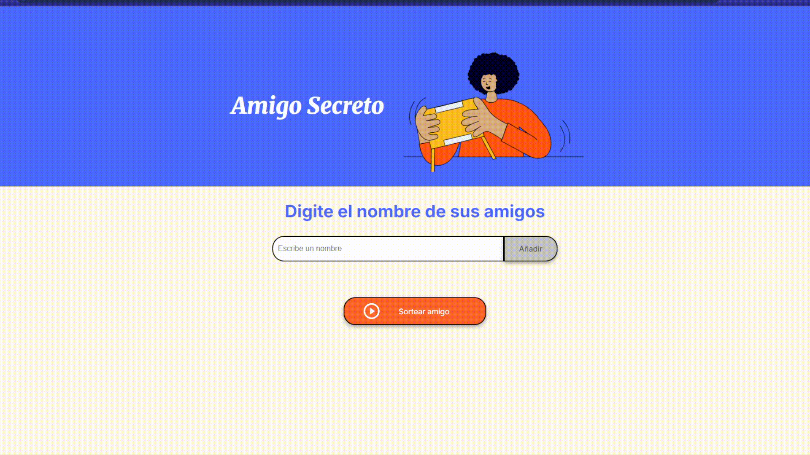
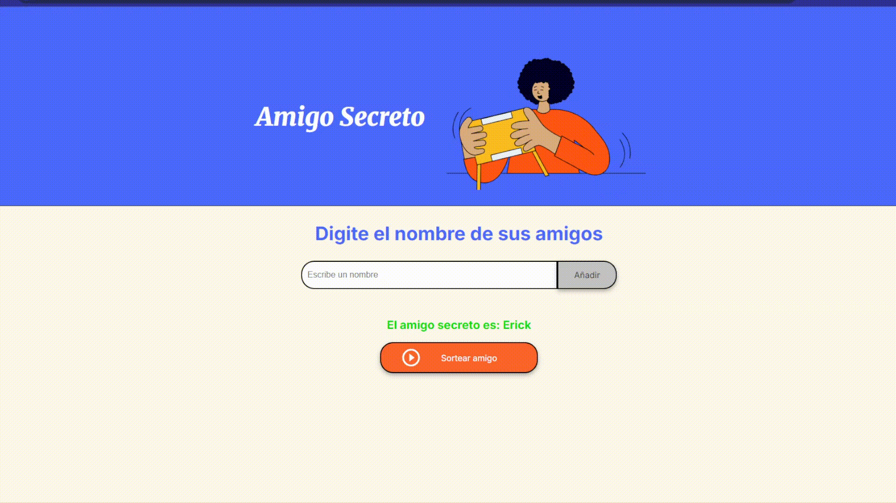

# 🎁 Amigo Secreto

Este es un proyecto web simple para realizar sorteos de "Amigo Secreto". Permite ingresar nombres de participantes y, con un solo clic, sortear al afortunado.

## 🧩 Tecnologías usadas

- **HTML5**: estructura de la página.
- **CSS3**: estilos personalizados y responsivos.
- **JavaScript**: lógica del sorteo y manejo de la lista de nombres.

## 🚀 Funcionalidades

- Agregar nombres a una lista.
- Mostrar la lista de participantes.
- Sortear aleatoriamente un nombre de la lista.
- Mostrar el nombre sorteado y reiniciar la lista.

### 🧪 Prueba del funcionamiento del juego

En esta demostración se muestran los pasos básicos del uso del sorteo de Amigo Secreto. Se ingresan cinco nombres y luego se presiona el botón **"Sortear amigo"**, lo que genera aleatoriamente a una persona seleccionada como el amigo secreto.

---

### 🚫 Validaciones de entrada

Este GIF muestra cómo la aplicación gestiona los errores de uso:

1. Se intenta añadir un nombre vacío, lo que dispara una alerta que solicita ingresar un nombre válido.
2. Luego se intenta realizar un sorteo sin tener al menos dos personas en la lista, lo que muestra una alerta indicando que se necesitan al menos dos participantes para sortear.

